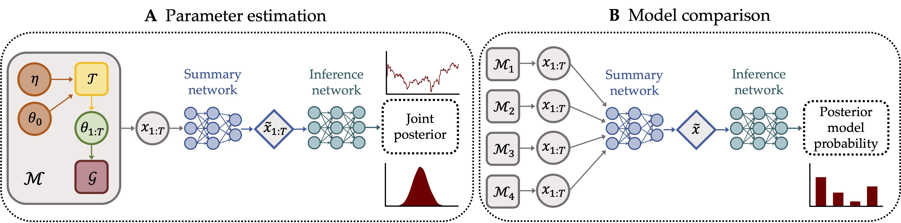

# Validation of a Non-Stationary Cognitive Models



Superstatistics are emerging as a flexible framework for incorporating *non-stationary* dynamics into existing cognitive model classes.
In this work, we provide the first experimental validation of superstatistics and formal comparison of four non-stationary diffusion decision models in a specifically designed perceptual decision-making task.
This repository contains the data and code for running the experiments and reproducing all results reported in our paper [Validation and Comparison of Non-Stationary Cognitive Models: A Diffusion Model Application]([https://arxiv.org/abs/2401.08626](https://link.springer.com/article/10.1007/s42113-024-00218-4)).

The code depends on the [BayesFlow](https://github.com/stefanradev93/BayesFlow) library, which implements the neural network architectures and training utilities.

## Cite

```bibtex
@article{schumacher2024,
  title = {Validation and {{Comparison}} of {{Non-stationary Cognitive Models}}: {{A Diffusion Model Application}}},
  shorttitle = {Validation and {{Comparison}} of {{Non-stationary Cognitive Models}}},
  author = {Schumacher, Lukas and Schnuerch, Martin and Voss, Andreas and Radev, Stefan T.},
  year = {2024},
  month = oct,
  journal = {Computational Brain \& Behavior},
  doi = {10.1007/s42113-024-00218-4}
}
```

## [Applications](applications)

All applications are structured as runable python scripts or jupyter notebooks, which are detailed below.

### Inference

- [Model evaluation](applications/inference/model_evaluation.py): Visualization of inferred parameter trajectory and aggregated posterior re-simulation results.
- [Response time series](applications/inference/notebooks/response_time_series.ipynb): Posterior re-simulation and prediction of response time series.

### Model comparison

- [Network validation](applications/model_comparison/network_validation.py): In silico model comparison and sensitivity results.
- [Network application](applications/model_comparison/network_application.py): Empirical model comparison results.

## Support

This work was supported by the Deutsche Forschungsgemeinschaft (DFG, German Research Foundation; grant number GRK 2277 ”Statistical Modeling in Psychology”)

## License

MIT

